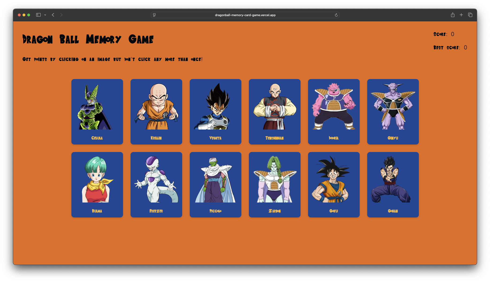

# Dragon Ball Memory Card Game

A memory card game built with React featuring Dragon Ball characters. Test your memory by clicking on different characters without repeating any.



## Live Demo

[Play the game here](https://dragonball-memory-card-game.vercel.app/)

## How to Play

1. Click on any Dragon Ball character card
2. Try to click on all different characters without repeating
3. Your score increases with each new character clicked
4. If you click the same character twice, the game resets
5. Beat your best score!

## Features

- Responsive card layout with flip animations
- Score tracking with best score persistence
- Character data fetched from Dragon Ball API
- Custom Dragon Ball themed styling with Saiyan-Sans font
- Smooth card shuffle animations

## Technologies Used

- React
- JavaScript (ES6+)
- CSS3 with animations
- Lodash (for shuffling)
- Dragon Ball API

## Installation

1. Clone the repository
```bash
git clone https://github.com/daniyxlkhan/memory-card-game.git
```

2. Navigate to the project directory
```bash
cd memory-card-game
```

3. Install dependencies
```bash
npm install
```

4. Start the development server
```bash
npm run dev
```

5. Open your browser and visit `http://localhost:5173`

